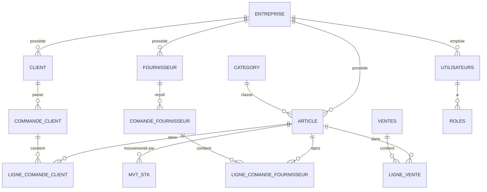

# 04 — Modèle de données

Le schéma est d'abord généré par Hibernate (`ddl-auto=update`), puis les migrations
**Flyway** appliquent les évolutions. La table `flyway_schema_history` trace l'état.

## 1. Diagramme entité-relation (vue simplifiée)



## 2. Tables principales

### entreprise
| Colonne | Type | Notes |
|---|---|---|
| id | BIGINT PK | |
| nom, description, codefiscale | VARCHAR | |
| email, num_tel, site_web, photo | VARCHAR | |
| adresse (embarquée) | — | addresse1, addresse2, ville, code_postale, pays |
| creation_date, last_modified_date | TIMESTAMP | hérité d'`AbstractEntity` |

### utilisateurs
| Colonne | Type | Notes |
|---|---|---|
| id | BIGINT PK | |
| nom, prenom, email (unique), mot_de_passe | VARCHAR | mot de passe hashé **BCrypt** |
| date_de_naissance, photo | VARCHAR | |
| ville, addresse1, addresse2, code_postale, pays | VARCHAR | adresse embarquée |
| identreprise | FK → entreprise | tenant |

### roles
| Colonne | Type | Notes |
|---|---|---|
| id | BIGINT PK | |
| rolename | VARCHAR | `ADMIN`, `MANAGER`, `VENDEUR` |
| utilisateur_id | FK → utilisateurs | |

### article
| Colonne | Type | Notes |
|---|---|---|
| id | BIGINT PK | |
| code_article | VARCHAR | |
| designation | VARCHAR | |
| prix_unitaire, taux_tva, prix_unitaire_ttc | NUMERIC | TTC = HT + TVA |
| seuil_alerte | NUMERIC | ajouté par migration `V3__seuil_alerte_article.sql` |
| photo | VARCHAR | URL relative `/photos/...` |
| id_category | FK → category | |
| identreprise | INT | tenant |

### category
| Colonne | Type |
|---|---|
| id (PK), code_category, designation, identreprise | — |

### client / fournisseur (structures identiques)
| Colonne | Type | Notes |
|---|---|---|
| id | BIGINT PK | |
| nom, prenom, mail, num_tel, photo | VARCHAR | |
| addresse1, addresse2, ville, code_postale, pays | VARCHAR | adresse embarquée |
| identreprise | INT | tenant |

### commande_client
| Colonne | Type | Notes |
|---|---|---|
| id | BIGINT PK | |
| code | VARCHAR | ex. `CMD-2026-001` |
| datecomande | TIMESTAMP | |
| etatcommande | VARCHAR | `EN_PREPARATION` / `VALIDEE` / `LIVREE` (migration `V2`) |
| id_client | FK → client | |
| identreprise | INT | tenant |

### ligne_comande_client
| Colonne | Type |
|---|---|
| id (PK), quantite, prix_unitaire, identreprise | — |
| id_commande_client (FK), id_article (FK) | — |

### comande_fournisseur / ligne_comande_fournisseur
Mêmes structures que côté client (avec `id_fournisseur`).

### ventes
| Colonne | Type |
|---|---|
| id (PK), code, date_vente, commentaire, identreprise | — |

### ligne_vente
| Colonne | Type |
|---|---|
| id (PK), quantite, prix_unitaire, identreprise | — |
| id_vente (FK), id_article (FK) | — |

### mvt_stk
| Colonne | Type | Notes |
|---|---|---|
| id | BIGINT PK | |
| date_mvt | TIMESTAMP | posé par le serveur |
| quantite | NUMERIC | **positif** pour une entrée, **négatif** pour une sortie |
| type_mvt | VARCHAR | `ENTREE` / `SORTIE` / `CORRECTION_POS` / `CORRECTION_NEG` |
| source_mvt | VARCHAR | `COMMANDE_CLIENT` / `COMMANDE_FOURNISSEUR` / `VENTE` (null si manuel) |
| id_article | FK → article | |
| identreprise | INT | tenant |

> **Stock réel** = `SUM(quantite)` sur `mvt_stk` pour un article donné.
> Aucun compteur redondant : impossible de désynchroniser.

## 3. Énumérations métier

```java
enum EtatCommande   { EN_PREPARATION, VALIDEE, LIVREE }
enum TypeMvtStk     { ENTREE, SORTIE, CORRECTION_POS, CORRECTION_NEG }
enum SourceMvtStk   { COMMANDE_CLIENT, COMMANDE_FOURNISSEUR, VENTE }
```

## 4. Migrations Flyway

| Fichier | Rôle |
|---|---|
| `V1__init.sql` | Placeholder — le schéma initial est créé par Hibernate |
| `V2__etat_commande_client_string.sql` | Évolution du stockage de l'état des commandes |
| `V3__seuil_alerte_article.sql` | Ajout de la colonne `seuil_alerte` sur `article` |
| `V4__entreprise_novatra_distribution.sql` | Données : entreprise NOVATRA + utilisateurs + catalogue |
| `V5__entreprise_novatra_second_passage.sql` | Données complémentaires (commandes, ventes, mouvements) |
| `V6__correction_signe_sorties_novatra.sql` | Correction de signes des mouvements de sortie |
| `V7__realignment_sequences_apres_seed.sql` | Réalignement des séquences d'ID après seed |

Configuration : `spring.flyway.baseline-on-migrate=true`, `baseline-version=1`
(les bases préexistantes ne sont pas cassées).

## 5. Règles de cohérence (implémentées dans les services)

1. **Unicité email utilisateur** → `UTILISATEUR_ALREADY_EXISTS` si doublon.
2. **Suppression client** refusée s'il possède des commandes (`CLIENT_ALREADY_IN_USE`) ;
   idem fournisseur.
3. **Entreprise forcée** : à chaque création (article, client, commande, vente, mvt…),
   l'`identreprise` du token écrase celle éventuellement fournie par le client HTTP.
4. **Quantités** : jamais nulles ni nulles sur une ligne de commande (contrôleur + service).
5. **Mouvements** : la quantité est normalisée (absolue) puis signée selon le type ;
   le type est posé par l'endpoint, pas par le client.
6. **Mot de passe** : jamais renvoyé en JSON (`@JsonProperty(WRITE_ONLY)`), toujours hashé BCrypt.
