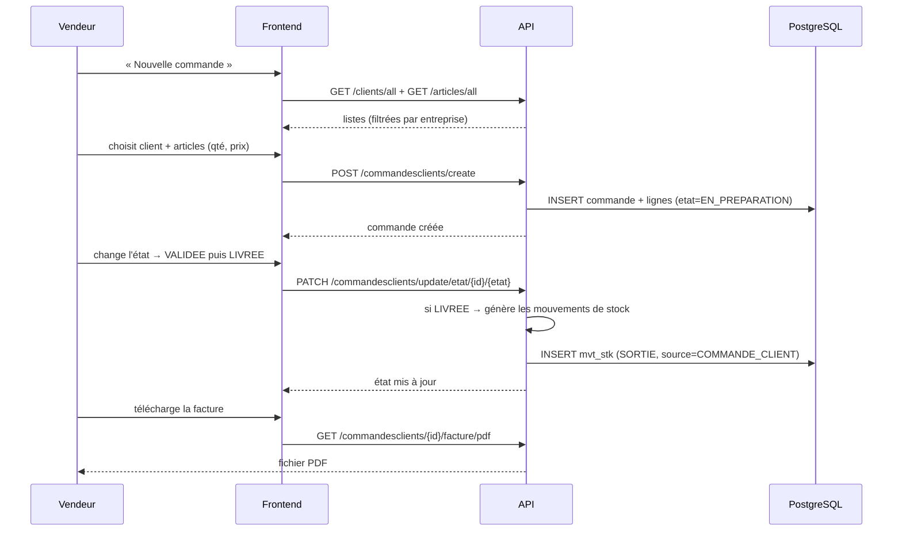

# 05 — Flux utilisateurs (de bout en bout)

Ce document décrit chaque parcours utilisateur **du début à la fin**, avec les appels API
effectués par les interfaces (les deux frontends suivent exactement les mêmes flux).

---

## 1. Inscription d'une entreprise (première visite)

```
Acteur : futur administrateur (aucun compte requis)
Écran : /login → « Créer mon entreprise » (frontend 3009)
```

1. L'utilisateur remplit le formulaire : nom, email (identifiant admin), téléphone,
   code fiscal, description, adresse.
2. Le frontend appelle `POST /entreprises/create` (route publique).
3. Le backend :
   - valide les données (`EntrepriseValidator`),
   - enregistre l'entreprise,
   - **crée automatiquement un utilisateur ADMIN** avec l'email saisi et un mot de passe
     temporaire (`Admin123!` par défaut),
   - renvoie la fiche entreprise **avec le mot de passe temporaire** dans la réponse.
4. L'interface affiche le mot de passe à l'utilisateur (toast) et pré-remplit le formulaire de login.
5. L'admin se connecte (flux § 2) puis **doit changer son mot de passe** (flux § 9).

---

## 2. Connexion / Déconnexion

```
Acteur : tout utilisateur
Écran : /login (3009) ou /login (4200)
```

**Connexion**
1. Saisie email + mot de passe → `POST /auth/authentification`.
2. Le backend vérifie les identifiants (BCrypt) et génère un **JWT** valable 8 h
   contenant : email (`sub`) et `idEntreprise`.
3. Le frontend stocke le token en `localStorage`.
4. Appel `GET /auth/me` → charge le profil complet (nom, photo, rôles, entreprise) et
   l'affiche dans le header / la sidebar.
5. Chaque requête suivante transporte `Authorization: Bearer <token>` (intercepteur Angular /
   wrapper fetch Next.js).

**Déconnexion** (bouton dans le header Angular / sidebar Next.js)
1. Purge du `localStorage` (token + profil).
2. Redirection vers `/login`.
3. Un token expiré ou invalide provoque côté API un 401 → les frontends redirigent
   automatiquement vers le login.

---

## 3. Gestion du catalogue (ADMIN / MANAGER)

### 3.1 Créer une catégorie
`/categories → Nouveau` → formulaire (code, désignation) → `POST /categories/create`
→ retour à la liste (rechargée depuis `GET /categories/all`).

### 3.2 Créer un article
`/articles → Nouvel article`
1. Formulaire : code, désignation, prix HT, TVA (le **prix TTC est calculé automatiquement**),
   seuil d'alerte, catégorie, **photo** (aperçu immédiat).
2. `POST /articles/create` → l'article est créé.
3. Si une photo a été choisie → `POST /photos/article/{id}` (upload multipart).
4. Retour à la liste ; la photo est servie publiquement via `/photos/**`.

### 3.3 Modifier / supprimer un article
- Modifier : pré-remplissage du formulaire via `GET /articles/{id}` puis POST create (upsert).
- Supprimer : confirmation → `DELETE /articles/delete/{id}` (refusée si l'article est
  référencé dans des commandes).

---

## 4. Tenue du stock (MANAGER / ADMIN)

### 4.1 Entrée / sortie manuelle
1. Page `/stock` → sélection d'un article → le **stock réel** s'affiche
   (`GET /mvtstk/stockreel/{id}`) avec son historique.
2. Boutons **Entrée / Sortie / Correction + / Correction −** → saisie de la quantité.
3. `POST /mvtstk/entree|sortie|correctionpos|correctionneg` avec `{ article: {id}, quantite }`.
4. Le backend pose la date, signe la quantité (négative pour sortie), enregistre.
5. Le stock affiché est recalculé ; l'historique se met à jour.

### 4.2 Correction d'inventaire
Identique à 4.1 avec `CORRECTION_POS` / `CORRECTION_NEG` : utilisée après comptage physique
pour réajuster le stock théorique. La trace reste visible dans l'historique (source = null).

### 4.3 Alertes de seuil
- Un article dont `stockReel ≤ seuilAlerte` est marqué **« Stock bas »**
  (page articles 3009, couleur rouge page stock, compteur sur le dashboard).
- Une tâche planifiée (cron `0 0 8 * * *`) peut envoyer un e-mail d'alerte
  (désactivé tant que `ALERT_EMAIL` n'est pas configuré).

---

## 5. Parcours COMMANDE CLIENT (vente sur commande)

```
Acteur : VENDEUR (ou plus)
Écran : /commandeclient (4200) ou /commandes (3009)
```



**Points clés**
- La commande naît en `EN_PREPARATION`.
- Le **stock n'est déduit qu'à la livraison** (`LIVREE`), pas à la création.
- La facture PDF est générée à la volée par le backend (OpenPDF).
- Suppression possible (`DELETE /commandesclients/delete/{id}`) tant que la commande existe.

---

## 6. Parcours COMMANDE FOURNISSEUR (approvisionnement)

```
Acteur : MANAGER / ADMIN
Écran : /commandefournissuer (4200) ou via l'API
```

1. Création : `POST /commandesfournisseurs/create` avec le fournisseur, les articles,
   quantités et prix d'achat. État initial : `EN_PREPARATION`.
2. Réception de la marchandise → `PATCH /update/etat/{id}/LIVREE`.
3. À la livraison, le backend génère pour chaque ligne une **entrée de stock**
   (`source = COMMANDE_FOURNISSEUR`) → le stock disponible augmente.
4. Suivi : `GET /commandesfournisseurs/all`, lignes via `/lignesCommande/{id}`.

> C'est le pendant de la commande client : chez le client on sort du stock, chez le
> fournisseur on en rentre. Les deux reposent sur le même mécanisme d'états.

---

## 7. Parcours VENTE directe

```
Acteur : VENDEUR (ou plus)
Écran : /ventes (3009)
```

1. `Nouvelle vente` → saisie du code, commentaire, ajout des lignes
   (article, quantité, prix TTC pré-rempli).
2. `POST /ventes/create`.
3. Le backend enregistre la vente **et génère immédiatement une sortie de stock**
   (`source = VENTE`) pour chaque ligne — contrairement à la commande client,
   ici le stock est déduit à l'instant de la vente.
4. Le dashboard (CA jour/mois/total, top articles) se met à jour.

---

## 8. Parcours GESTION CLIENTS / FOURNISSEURS

1. **Liste** : `GET /clients/all` (4200) ou `/clients/paged` (3009, avec tri et recherche).
2. **Création** : formulaire (nom, prénom, email, téléphone, adresse complète) →
   `POST /clients/create` — l'entreprise du token est forcée côté serveur.
3. **Modification** : liste → bouton *Modifier* → formulaire pré-rempli (`GET /clients/{id}`)
   → `PUT /clients/update/{id}`.
4. **Suppression** : confirmation → `DELETE /clients/delete/{id}` ;
   refusée si le client a des commandes (`CLIENT_ALREADY_IN_USE`) → message d'erreur affiché.
5. Même parcours pour les fournisseurs (`/fournisseurs/...`).

---

## 9. Parcours PROFIL (tout utilisateur)

1. Accès : clic sur l'avatar (header 4200 / sidebar+topbar 3009) → page profil.
2. Lecture : `GET /auth/me` → nom, prénom, email (non modifiable), date de naissance,
   rôles, entreprise, adresse, photo.
3. **Modification des informations** : bouton *Modifier* → édition nom, prénom,
   date de naissance, adresse → `PUT /utilisateurs/me`.
   - Sécurité : l'endpoint identifie l'utilisateur par son **token**, jamais par un id
     envoyé par le client — chacun ne peut modifier que son propre profil.
4. **Photo de profil** : choisir une image (jpg/png/webp ≤ 5 Mo) → aperçu local →
   `POST /utilisateurs/me/photo` (multipart).
   - Le backend enregistre le fichier (UUID), remplace l'ancienne photo sur le disque,
     met à jour le champ `photo`.
5. Le localStorage est réactualisé → l'avatar du header change immédiatement.

### 9.1 Changement de mot de passe
Page dédiée : ancien mot de passe (si contexte normal), nouveau + confirmation →
`POST /utilisateurs/update/password`.
- Un utilisateur ne peut changer que **son** mot de passe ;
- l'ADMIN peut changer celui de n'importe quel utilisateur de son entreprise.

---

## 10. Parcours ADMINISTRATION DES UTILISATEURS (ADMIN)

1. **Liste** : `GET /utilisateurs/all` → utilisateurs de l'entreprise avec leurs rôles.
2. **Création** : formulaire complet + mot de passe provisoire + rôle initial →
   `POST /utilisateurs/create` puis `PUT /utilisateurs/roles/{id}/{role}`.
3. **Rôles** : sélection d'un rôle supplémentaire dans la liste → `PUT /utilisateurs/roles/{id}/{role}`
   (rôles disponibles : ADMIN, MANAGER, VENDEUR).
4. **Suppression** : `DELETE /utilisateurs/delete/{id}`.
5. Tous ces endpoints sont protégés par `@PreAuthorize("hasAuthority('ADMIN')")` —
   un MANAGER ou VENDEUR reçoit un 403.

---

## 11. Parcours PILOTAGE (dashboard + exports)

1. **Dashboard** (`/` ou `/dashboard`) : `GET /dashboard` renvoie
   - CA jour / mois / total, nombre de ventes,
   - valeur du stock, marge moyenne, articles sous seuil,
   - top 5 articles (quantités et CA), top clients (commandes et montants),
   - répartition du CA par catégorie, série mensuelle de CA.
   Les deux frontends le rendent sous forme de KPI et graphiques.
2. **Statistiques détaillées** (4200 `/statistique`) : camembert catégories,
   barres mensuelles, tableau top 10 articles — mêmes données.
3. **Exports** (ADMIN/MANAGER) : boutons Excel/CSV sur les listes →
   `GET /exports/...` → téléchargement d'un fichier limité à l'entreprise courante.

---

## 12. Résumé des permissions par écran

| Écran | VENDEUR | MANAGER | ADMIN |
|---|---|---|---|
| Dashboard / stats / exports | lecture | + exports | + exports |
| Articles & catégories | lecture | + création/modif | + suppression |
| Clients / fournisseurs | lecture | + CRUD complet | + CRUD complet |
| Commandes clients | + création, états | + suppression | + suppression |
| Commandes fournisseurs | lecture | + création, états, suppression | idem |
| Ventes | + création | + suppression | + suppression |
| Mouvements de stock | lecture | + écritures | + écritures |
| Utilisateurs | lecture seule | lecture seule | + création/rôles/suppression |
| Mon profil | + édition + photo | + édition + photo | + édition + photo |
