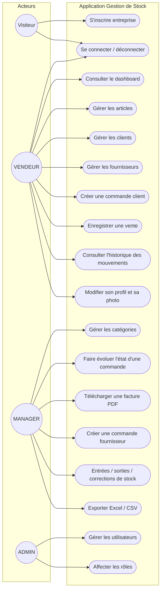
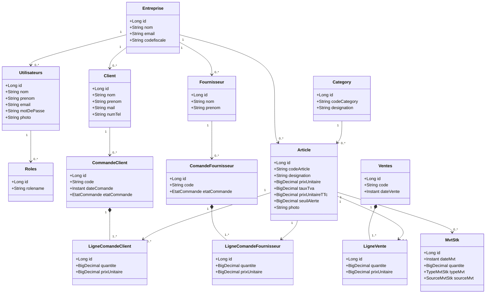
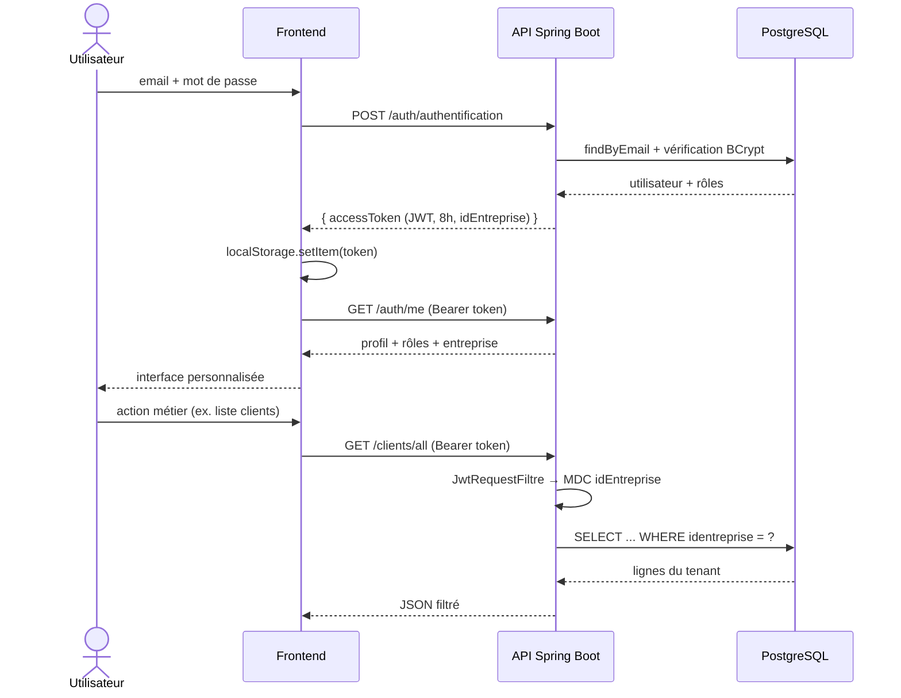
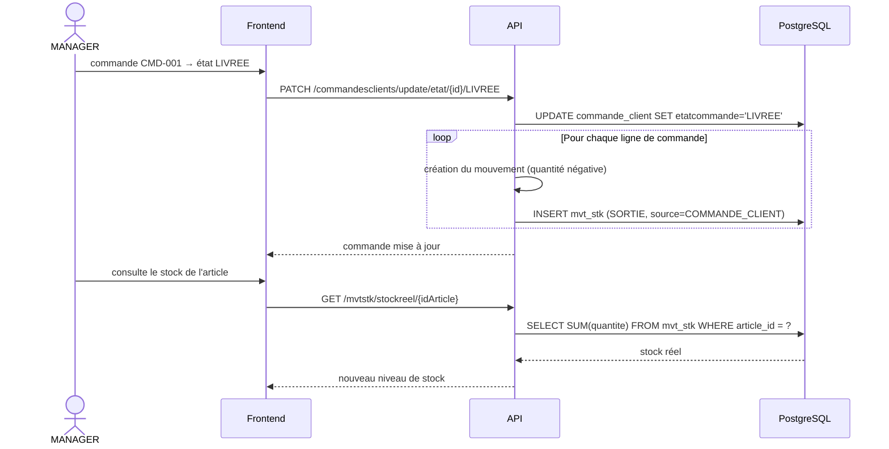
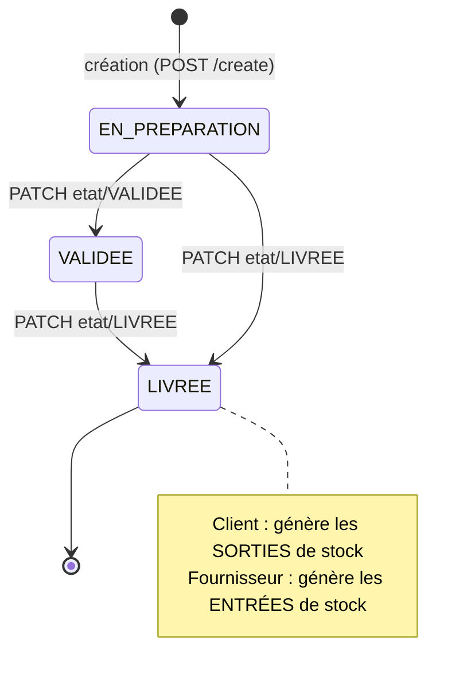
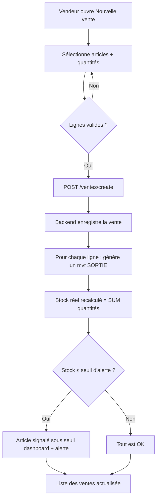
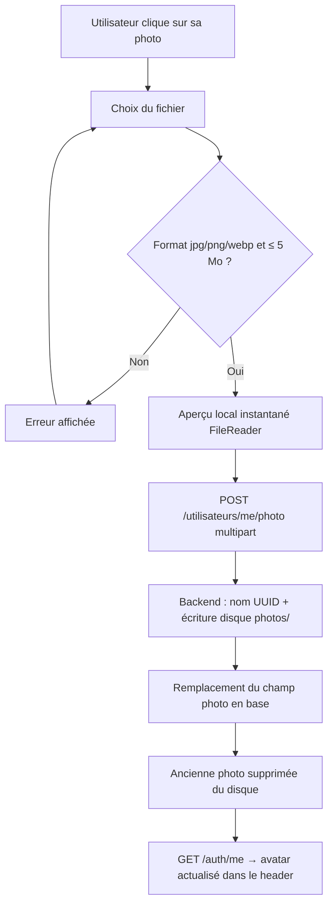
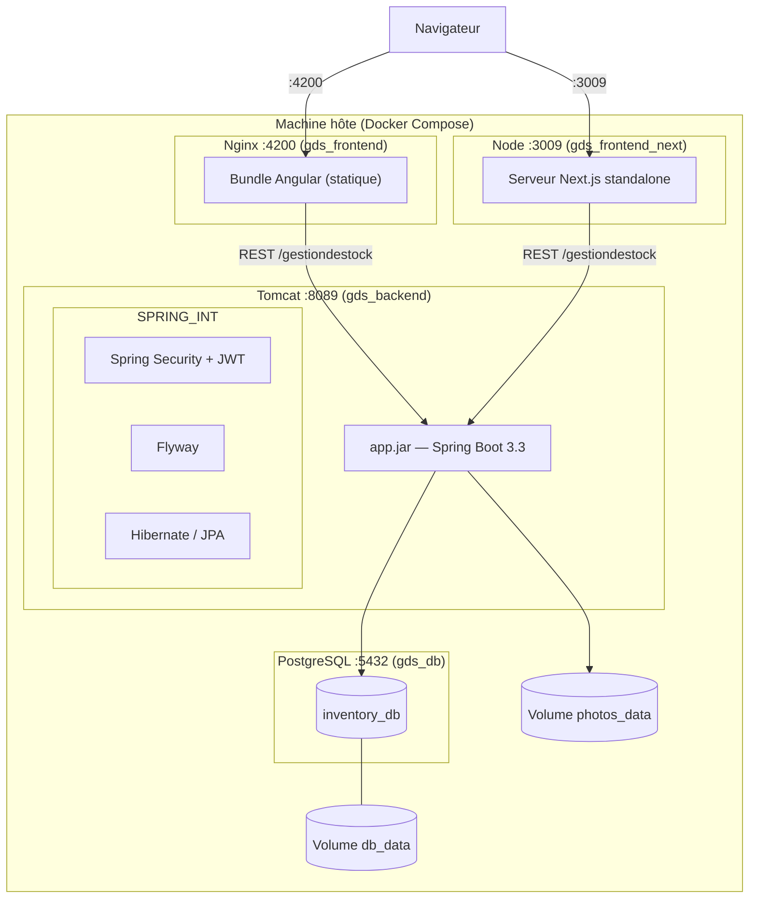
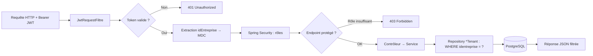

# 06 — Diagrammes

Tous les diagrammes sont en **Mermaid** : ils s'affichent nativement sur GitHub/GitLab,
dans VS Code (extension Mermaid Preview) et sur [mermaid.live](https://mermaid.live).

---

## 1. Diagramme de cas d'utilisation

---

## 2. Diagramme de classes (cœur métier)

---

## 3. Diagramme de séquence — Connexion et appel authentifié

---

## 4. Diagramme de séquence — Livraison d'une commande client (impact stock)

---

## 5. Machine à états — Cycle de vie d'une commande

---

## 6. Diagramme d'activité — Vente directe avec contrôle de stock

---

## 7. Diagramme d'activité — Upload d'une photo de profil

---

## 8. Diagramme de déploiement

---

## 9. Diagramme entité-relation

Voir [04. Modèle de données](./04-modele-de-donnees.md) § 1 (diagramme ERD Mermaid).

---

## 10. Vue du flux multi-tenant (pipeline d'une requête)

